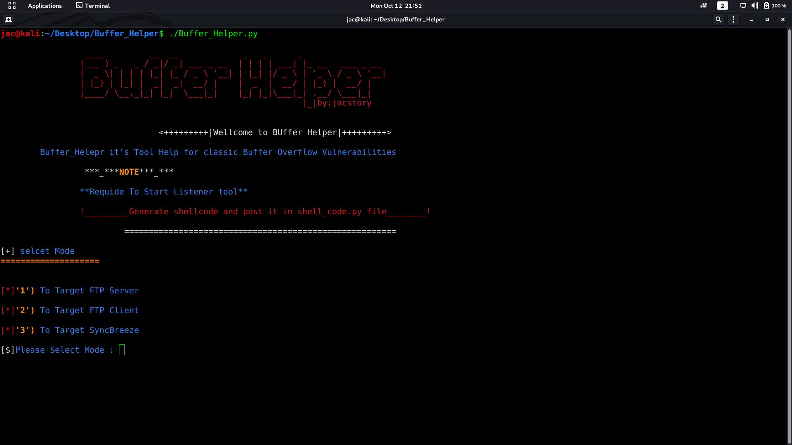
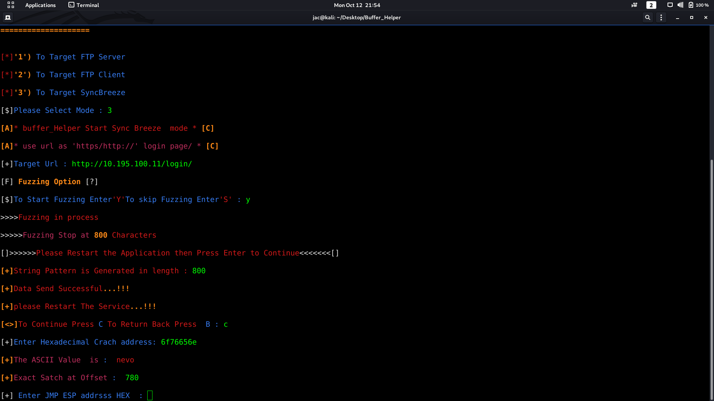
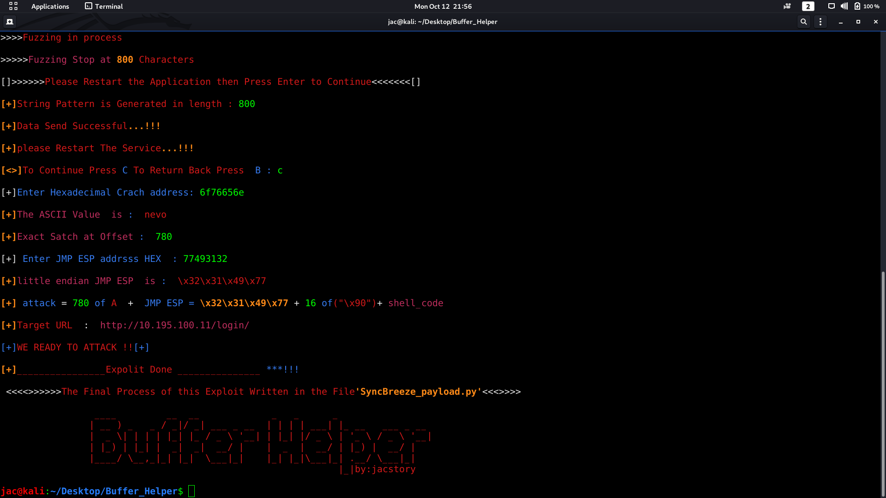
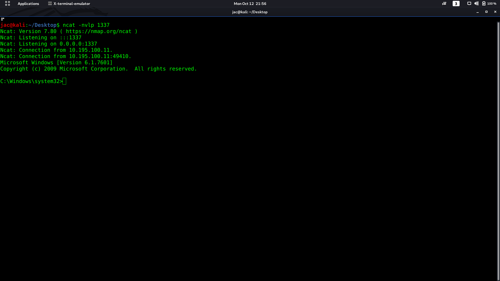

# Buffer_helper

* Buffer_Helper it's tool help for Test classic Buffer overflow vulnerability .

* write by python 2.7
## Required Library
* to Target http Service login page 'sync Breeze ' run flowing command
* pip install requests
## how to use 
*  git clone  https://github.com/jac11/Buffer_Helper.git

*  cd Buffer_Helper

*  Generate shellcode and post it in shell_code.py file

*  chmod + x Buffer_Helper.py

*  Start Listener tool

* ./ Buffer_Helper.py

* after the Exploit is successful the Buffer_helper will give you output file have the ready Exploit

## screenshot
* this screenshot 'sync Breeze Exploit'

   

## Required Software / Setup

* attacker system: Kali Linux

* Victim system: Windows 

* Immunity debugger  https://www.immunityinc.com/products/debugger/

* FloatFTP - The application we are going to exploit  https://archive.org/details/tucows_367516_Freefloat_FTP_Server

##  for Contact  

* administrator@jacstory.tech 

* thank you  
