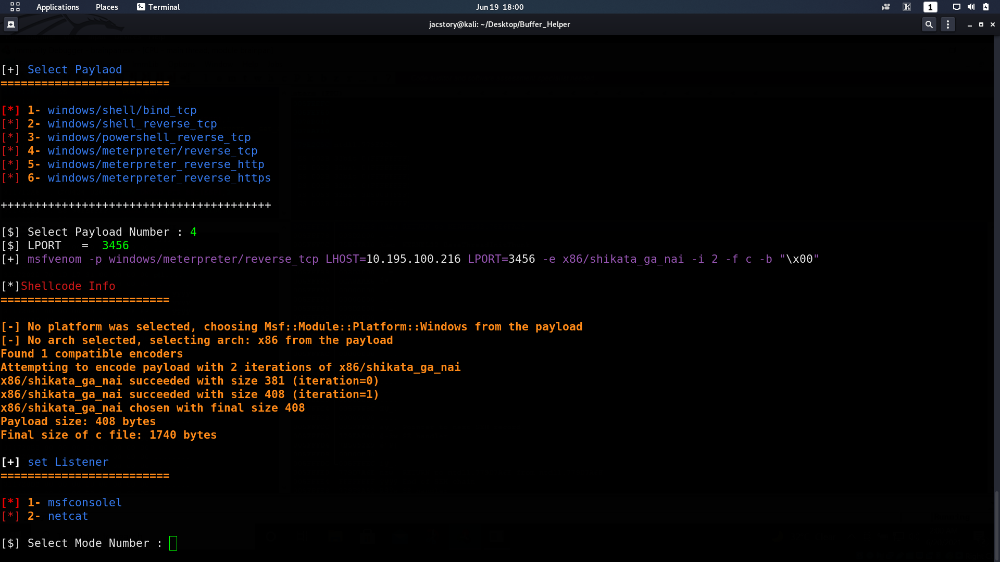

# Buffer_helper

* Buffer_Helper it's tool help for Test classic Buffer overflow vulnerability .

* write by python 2.7
## Required Library
* to Target http Service login page 'sync Breeze ' run flowing command
* pip install requests
## how to use 
*  git clone  https://github.com/jac11/Buffer_Helper.git

*  cd Buffer_Helper

*  Generate shellcode and post it in shell_code.py file

*  chmod + x Buffer_Helper.py

*  Start Listener tool

* ./ Buffer_Helper.py
* use ./Buffer_Helper.py -c off 'to set color off to use  the code with out color'

## screenshot
* this screenshot 'sync Breeze Exploit'

  

* after the Exploit is successful the Buffer_helper will auto write output file have the ready Exploit

## Required Software / Setup

* attacker system: Kali Linux

* Victim system: Windows 

* Immunity debugger  https://www.immunityinc.com/products/debugger/

* FloatFTP - The application we are going to exploit  https://archive.org/details/tucows_367516_Freefloat_FTP_Server

## Update:-

- added one module msf_help.py subprocess to call msfvenom to generate shellcode use subprocess call msfvanom
  * set listener msfconsole or netcat
  *  auto cat msfconsole and set all variable auto
  *  Label the steps
  *  handle error and bugs

   
 * ./Buffer_Helper.py -c off
 -------------------------------
   
  
  ## Over view
   
  
* thank you  
